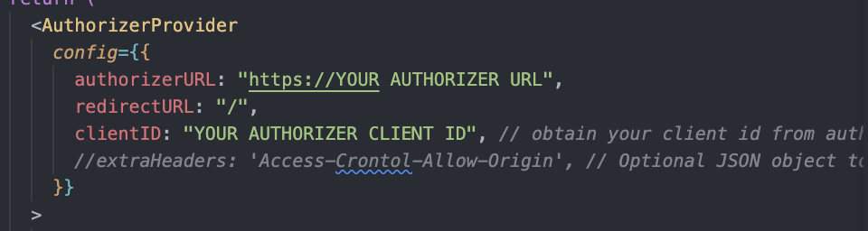

# Welcome to Authorizer + Remix + Chakra-UI!

- [Remix Docs](https://remix.run/docs)
- [Authorizer Docs](https://docs.authorizer.dev/)
- [Chakra-UI Docs](https://chakra-ui.com/getting-started)

## Setup Authorizer

- I recommend deploying an instance of Authorizer to Railway! There free option is great just attach a database set your environment variables and go! (You will need the required environment variables see the docs [here](https://docs.authorizer.dev/core/env)
  
[](https://railway.app/new/template/nwXp1C?referralCode=FEF4uT)

- Once deployed make sure to setup any third party OAuth you want such as Github here `YOUR Authorizer URL/dashboard/oauth-setting` or you can use standard auth with Emails and Passwords.

- On the same page as your OAuth config copy your `Client Id` past it in `root.tsx` where it says `YOUR AUTHORIZER CLIENT ID` you will also need to add your Authorizer URL where it says `YOUR AUTHORIZER URL`


---

## Development

From your terminal:

```sh
npm run dev
```

This starts your app in development mode, rebuilding assets on file changes.

## Deployment

First, build your app for production:

```sh
npm run build
```

Then run the app in production mode:

```sh
npm start
```

Now you'll need to pick a host to deploy it to.

### DIY

If you're familiar with deploying node applications, the built-in Remix app server is production-ready.

Make sure to deploy the output of `remix build`

- `build/`
- `public/build/`

### Using a Template

When you ran `npx create-remix@latest` there were a few choices for hosting. You can run that again to create a new project, then copy over your `app/` folder to the new project that's pre-configured for your target server.

```sh
cd ..
# create a new project, and pick a pre-configured host
npx create-remix@latest
cd my-new-remix-app
# remove the new project's app (not the old one!)
rm -rf app
# copy your app over
cp -R ../my-old-remix-app/app app
```
